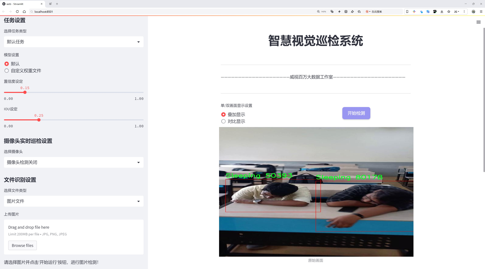
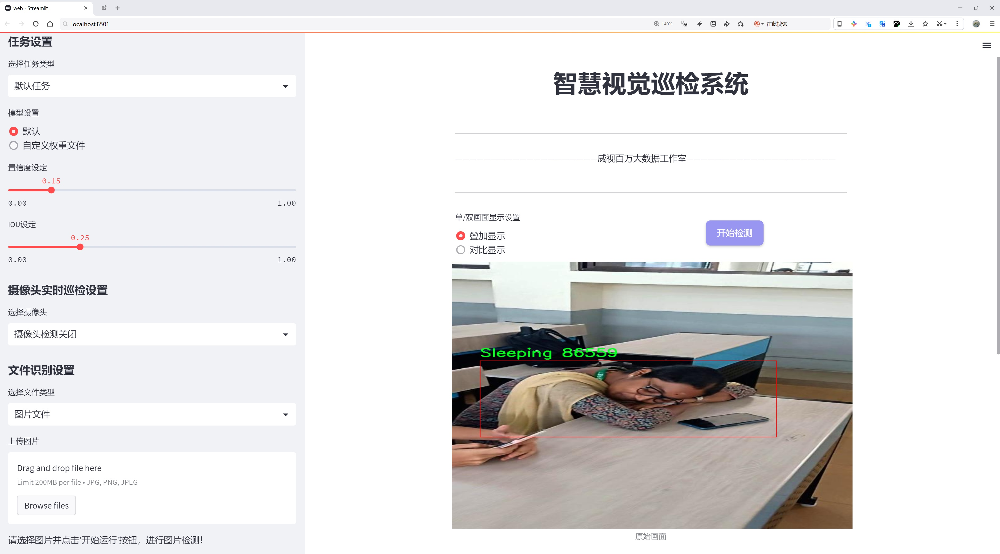
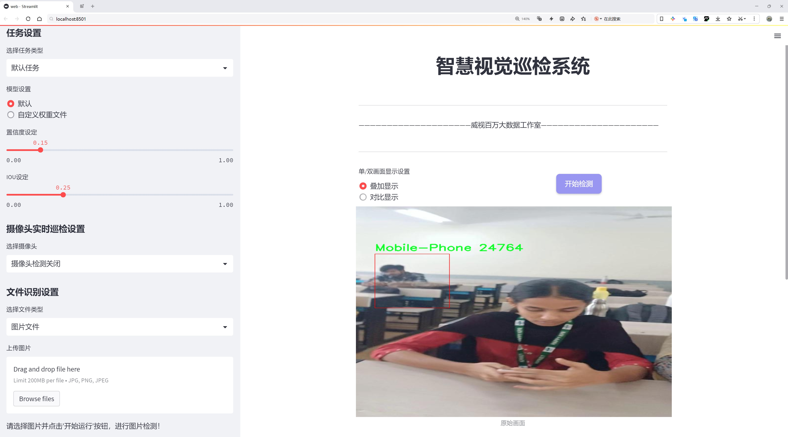
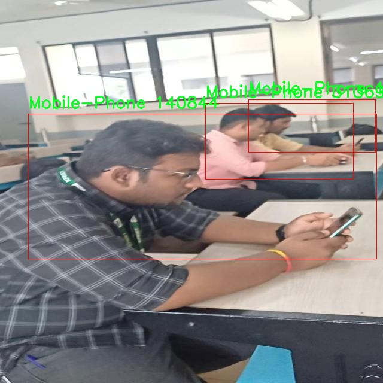
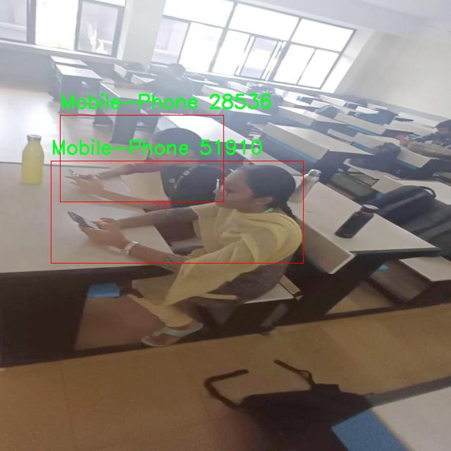
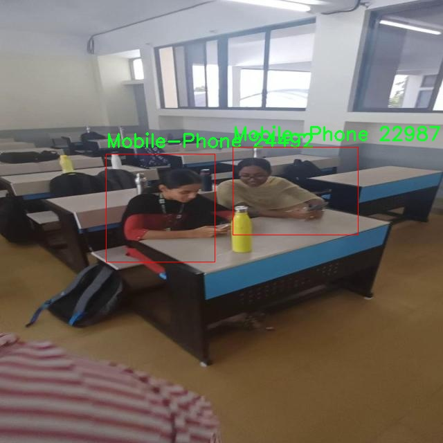
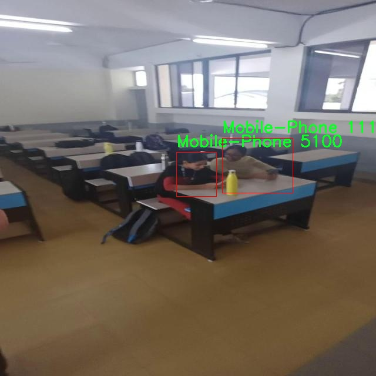
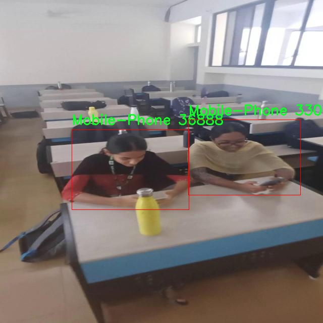
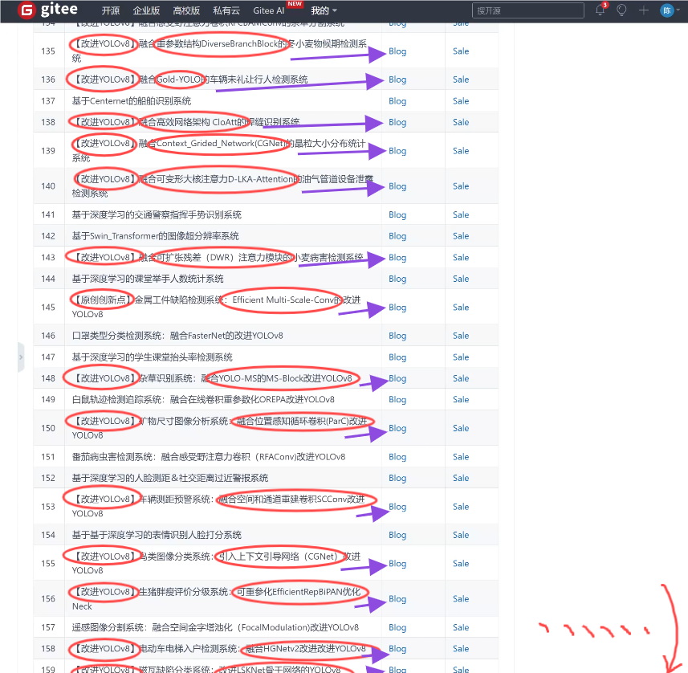

# 学生课堂行为检测检测系统源码分享
 # [一条龙教学YOLOV8标注好的数据集一键训练_70+全套改进创新点发刊_Web前端展示]

### 1.研究背景与意义

项目参考[AAAI Association for the Advancement of Artificial Intelligence](https://gitee.com/qunshansj/projects)

项目来源[AACV Association for the Advancement of Computer Vision](https://gitee.com/qunmasj/projects)

研究背景与意义

随着信息技术的迅猛发展，教育领域也在不断探索如何利用先进的技术手段提升教学质量和管理效率。课堂行为检测作为教育管理的重要组成部分，能够实时监测学生在课堂上的行为表现，为教师提供有价值的反馈，进而改善教学策略和学习环境。然而，传统的课堂行为监测方法往往依赖人工观察，效率低下且容易受到主观因素的影响。因此，基于计算机视觉和深度学习技术的自动化课堂行为检测系统应运而生，成为教育管理领域的研究热点。

YOLO（You Only Look Once）系列模型因其高效的实时目标检测能力而广泛应用于各类视觉任务。YOLOv8作为该系列的最新版本，结合了更为先进的网络结构和算法优化，具备更强的检测精度和速度。通过对YOLOv8模型的改进，研究者能够更好地适应课堂环境的复杂性，尤其是在多种行为类别的识别上。本文旨在基于改进的YOLOv8模型，构建一个高效的学生课堂行为检测系统，以实现对学生行为的精准识别和分类。

本研究所使用的数据集“CampusGuard”包含3345张图像，涵盖了六个行为类别：使用手机、未佩戴安全头盔、睡觉、三人组、暴力行为等。这些类别不仅反映了学生在课堂上的常见行为，还涉及到课堂管理和安全教育的重要方面。通过对这些行为的检测与分析，教师可以及时了解学生的注意力集中情况、课堂纪律和潜在的安全隐患，从而采取相应的措施进行干预。此外，数据集的多样性和丰富性为模型的训练提供了良好的基础，能够有效提升模型的泛化能力和实用性。

在当前教育环境中，学生的课堂行为不仅影响个人学习效果，也对整个班级的学习氛围产生重要影响。通过建立一个基于改进YOLOv8的课堂行为检测系统，能够实现对学生行为的实时监控，帮助教师及时发现问题并进行针对性指导。同时，该系统的应用也有助于推动教育管理的智能化发展，提升教育质量，促进学生的全面发展。

综上所述，基于改进YOLOv8的学生课堂行为检测系统的研究，不仅具有重要的理论意义，还具备广泛的实践应用价值。通过深入探索和应用这一技术，能够为教育管理提供新的思路和方法，推动教育领域的技术创新与发展。未来，随着技术的不断进步和数据集的不断丰富，该系统有望在更广泛的教育场景中得到应用，为实现更高效的课堂管理和更优质的教育服务奠定基础。

### 2.图片演示







##### 注意：由于此博客编辑较早，上面“2.图片演示”和“3.视频演示”展示的系统图片或者视频可能为老版本，新版本在老版本的基础上升级如下：（实际效果以升级的新版本为准）

  （1）适配了YOLOV8的“目标检测”模型和“实例分割”模型，通过加载相应的权重（.pt）文件即可自适应加载模型。

  （2）支持“图片识别”、“视频识别”、“摄像头实时识别”三种识别模式。

  （3）支持“图片识别”、“视频识别”、“摄像头实时识别”三种识别结果保存导出，解决手动导出（容易卡顿出现爆内存）存在的问题，识别完自动保存结果并导出到tempDir中。

  （4）支持Web前端系统中的标题、背景图等自定义修改，后面提供修改教程。

  另外本项目提供训练的数据集和训练教程,暂不提供权重文件（best.pt）,需要您按照教程进行训练后实现图片演示和Web前端界面演示的效果。

### 3.视频演示

[3.1 视频演示](https://www.bilibili.com/video/BV1Er4neSELB/)

### 4.数据集信息展示

##### 4.1 本项目数据集详细数据（类别数＆类别名）

nc: 5
names: ['Mobile-Phone', 'No-Helmet', 'Sleeping', 'Triples', 'Violence']


##### 4.2 本项目数据集信息介绍

数据集信息展示

在构建一个高效的学生课堂行为检测系统的过程中，数据集的选择与构建至关重要。为此，我们选用了名为“CampusGuard”的数据集，该数据集专门针对校园环境中的学生行为进行标注与分类，旨在为改进YOLOv8模型提供丰富的训练样本。该数据集包含五个主要类别，分别是“Mobile-Phone”（使用手机）、“No-Helmet”（未佩戴头盔）、“Sleeping”（睡觉）、“Triples”（三人组行为）和“Violence”（暴力行为）。这些类别不仅涵盖了课堂内外的常见行为，还反映了校园安全与学生行为管理的多样性。

“CampusGuard”数据集的构建过程注重多样性与真实性，确保所收集的样本能够真实反映校园生活中的各种行为。数据集中的每个类别都经过精心标注，旨在为模型提供清晰且准确的训练数据。例如，在“Mobile-Phone”类别中，样本包括学生在课堂上使用手机的不同场景，这不仅有助于识别分心行为，还能为教育管理者提供改进课堂管理的依据。而在“No-Helmet”类别中，数据集中包含了未佩戴头盔的学生在校园内骑行的情况，这一行为的监测有助于提升学生的安全意识。

“Sleeping”类别则关注于学生在课堂上打瞌睡的行为，这一现象在许多学校中普遍存在，可能与课堂内容的吸引力或学生的学习状态有关。通过对这一行为的检测，教师可以及时调整教学策略，提升课堂的参与度与学习效果。与此同时，“Triples”类别记录了三人组的互动行为，这一行为在校园社交中非常常见，能够反映学生之间的合作与交流。最后，“Violence”类别则是对校园暴力行为的监测，旨在通过早期识别潜在的危险行为，保障学生的安全与心理健康。

为了确保数据集的有效性与可靠性，“CampusGuard”数据集的样本来源于多个校园，涵盖了不同的时间段与环境。这种多样化的样本收集方式不仅增强了数据集的代表性，还提高了模型在实际应用中的适应能力。数据集中的每个样本都附有详细的标注信息，包括行为发生的时间、地点及相关背景信息，这为后续的模型训练提供了丰富的上下文。

在使用“CampusGuard”数据集进行YOLOv8模型的训练时，我们期望通过高质量的标注数据，提升模型对学生行为的识别精度与实时反应能力。通过不断优化模型的训练过程，我们希望能够实现对校园内学生行为的全面监测与分析，从而为教育管理者提供数据支持，促进校园环境的安全与和谐。

总之，“CampusGuard”数据集为学生课堂行为检测系统的开发提供了坚实的基础。通过对校园内学生行为的深入分析与识别，我们不仅能够提高课堂管理的效率，还能为学生创造一个更加安全与友好的学习环境。











### 5.全套项目环境部署视频教程（零基础手把手教学）

[5.1 环境部署教程链接（零基础手把手教学）](https://www.ixigua.com/7404473917358506534?logTag=c807d0cbc21c0ef59de5)


[5.2 安装Python虚拟环境创建和依赖库安装视频教程链接（零基础手把手教学）](https://www.ixigua.com/7404474678003106304?logTag=1f1041108cd1f708b01a)

### 6.手把手YOLOV8训练视频教程（零基础小白有手就能学会）

[6.1 手把手YOLOV8训练视频教程（零基础小白有手就能学会）](https://www.ixigua.com/7404477157818401292?logTag=d31a2dfd1983c9668658)

### 7.70+种全套YOLOV8创新点代码加载调参视频教程（一键加载写好的改进模型的配置文件）

[7.1 70+种全套YOLOV8创新点代码加载调参视频教程（一键加载写好的改进模型的配置文件）](https://www.ixigua.com/7404478314661806627?logTag=29066f8288e3f4eea3a4)

### 8.70+种全套YOLOV8创新点原理讲解（非科班也可以轻松写刊发刊，V10版本正在科研待更新）

由于篇幅限制，每个创新点的具体原理讲解就不一一展开，具体见下列网址中的创新点对应子项目的技术原理博客网址【Blog】：



[8.1 70+种全套YOLOV8创新点原理讲解链接](https://gitee.com/qunmasj/good)

### 9.系统功能展示（检测对象为举例，实际内容以本项目数据集为准）

图9.1.系统支持检测结果表格显示

  图9.2.系统支持置信度和IOU阈值手动调节

  图9.3.系统支持自定义加载权重文件best.pt(需要你通过步骤5中训练获得)

  图9.4.系统支持摄像头实时识别

  图9.5.系统支持图片识别

  图9.6.系统支持视频识别

  图9.7.系统支持识别结果文件自动保存

  图9.8.系统支持Excel导出检测结果数据


### 10.原始YOLOV8算法原理

原始YOLOv8算法原理

YOLO（You Only Look Once）系列模型自2015年首次提出以来，经历了多个版本的迭代与优化，其中YOLOv8作为最新的版本，展现了在目标检测领域的显著进步。YOLOv8不仅在推理速度和检测精度上取得了优异的表现，还在易于训练和调整、硬件支持的广泛性以及对自定义数据集的原生支持等方面展现了其独特的优势。这些特性使得YOLOv8成为当前业界最受欢迎和成功的目标检测算法之一。

YOLOv8的网络结构主要由三部分组成：Backbone（骨干网络）、Neck（颈部结构）和Head（头部结构）。在这一结构中，Backbone负责特征提取，利用深度卷积神经网络（CNN）从输入图像中提取出丰富的特征信息。YOLOv8在Backbone部分采用了更为高效的网络设计，旨在通过减少计算量和参数量来提升模型的速度和精度。Neck部分则负责特征融合，结合来自不同层次的特征，以增强模型对多尺度目标的检测能力。YOLOv8引入了特征金字塔网络（FPN）和路径聚合网络（PAN）相结合的方式，使得不同尺度的特征能够有效地进行融合，从而提升了对小目标和大目标的检测能力。

在Head部分，YOLOv8采用了三个解耦头的设计，这一创新使得模型能够独立地处理不同的检测任务，如目标分类、边界框回归和目标置信度评估。通过这种解耦设计，YOLOv8能够更灵活地适应各种检测场景，并提高了整体的检测精度。此外，YOLOv8还引入了轻量化的解耦头，取代了传统的耦合头，这一变化使得模型在保持高精度的同时，进一步降低了计算复杂度，适合在资源受限的环境中部署。

在模型设置方面，YOLOv8提供了多个可调参数，包括depth_factor、width_factor和ratio等。这些参数的设置直接影响到模型的深度、宽度和通道数，用户可以根据具体的应用需求灵活调整这些参数。例如，depth_factor和width_factor的增大将导致网络变得更深和更宽，从而提升模型的表达能力，但同时也会增加计算负担；相反，减小这些参数则会使得模型变得更加轻量化，适合实时检测任务。

值得一提的是，YOLOv8还在轻量化模型YOLOv8n中进行了进一步的优化。在这一版本中，骨干特征提取网络层采用了更轻量化的C2F模块，取代了原有的C3模块，显著降低了计算复杂度。同时，在特征融合层减少了降采样层的数量，并使用C2F模块替换了C3模块，进一步提升了特征提取的效率。YOLOv8n的检测头层则采用了轻量化的解耦头，采用有锚目标检测的方式，确保在高效的同时不牺牲检测精度。

YOLOv8的设计理念不仅体现在其网络结构上，还体现在其对不同尺度特征信息的提取能力上。通过引入BiFPN网络，YOLOv8n能够实现高效的双向跨尺度连接和加权特征融合，这一机制使得模型在处理不同大小的目标时，能够更加灵活和高效。BiFPN通过删除单输入对应的节点，并在同一层的输入输出节点之间添加连接，极大地提高了特征信息的流动性和融合效果。

总的来说，YOLOv8的原始算法原理是基于深度学习的目标检测技术，通过精心设计的网络结构和高效的特征提取与融合机制，达到了快速、准确的目标检测效果。其在各个方面的优化，使得YOLOv8不仅适用于学术研究，也在工业界得到了广泛应用，成为了目标检测领域的重要工具。随着YOLOv8的不断发展与应用，未来的目标检测技术将更加智能化和高效化，为各行各业带来更多的可能性。


### 11.项目核心源码讲解（再也不用担心看不懂代码逻辑）

#### 11.1 ui.py

以下是对给定代码的核心部分进行提炼和详细注释的版本：

```python
import sys
import subprocess

def run_script(script_path):
    """
    使用当前 Python 环境运行指定的脚本。

    Args:
        script_path (str): 要运行的脚本路径

    Returns:
        None
    """
    # 获取当前 Python 解释器的路径
    python_path = sys.executable

    # 构建运行命令，使用 streamlit 运行指定的脚本
    command = f'"{python_path}" -m streamlit run "{script_path}"'

    # 执行命令并等待其完成
    result = subprocess.run(command, shell=True)
    
    # 检查命令执行结果，如果返回码不为0，表示执行出错
    if result.returncode != 0:
        print("脚本运行出错。")

# 主程序入口
if __name__ == "__main__":
    # 指定要运行的脚本路径
    script_path = "web.py"  # 这里可以直接指定脚本名称，假设在当前目录下

    # 调用函数运行脚本
    run_script(script_path)
```

### 代码核心部分分析：
1. **导入模块**：
   - `sys`：用于获取当前 Python 解释器的路径。
   - `subprocess`：用于执行外部命令。

2. **`run_script` 函数**：
   - 接收一个脚本路径作为参数，并使用当前 Python 环境运行该脚本。
   - 使用 `sys.executable` 获取当前 Python 解释器的路径，以确保使用正确的 Python 版本。
   - 构建命令字符串，使用 `streamlit` 运行指定的脚本。
   - 使用 `subprocess.run` 执行命令，并通过 `shell=True` 允许在 shell 中执行命令。
   - 检查命令的返回码，如果不为0，表示脚本运行失败，输出错误信息。

3. **主程序入口**：
   - 在脚本直接运行时，指定要执行的脚本路径（这里假设为 `web.py`）。
   - 调用 `run_script` 函数来执行指定的脚本。

### 总结：
该代码的核心功能是使用当前 Python 环境运行一个指定的 `streamlit` 脚本，并处理可能的错误。

这个文件是一个 Python 脚本，主要功能是运行一个名为 `web.py` 的脚本。首先，它导入了几个必要的模块，包括 `sys`、`os` 和 `subprocess`，这些模块分别用于处理系统相关的操作、文件路径和执行外部命令。

在文件的开头，定义了一个名为 `run_script` 的函数，该函数接受一个参数 `script_path`，表示要运行的脚本的路径。函数内部首先获取当前 Python 解释器的路径，这样可以确保使用正确的 Python 环境来执行脚本。接着，构建一个命令字符串，使用 `streamlit` 来运行指定的脚本。`streamlit` 是一个用于构建数据应用的框架。

随后，使用 `subprocess.run` 方法执行构建好的命令。这个方法会在一个新的 shell 中运行命令，并等待其完成。如果脚本运行过程中出现错误，返回码不为 0，程序会打印出“脚本运行出错”的提示信息。

在文件的最后部分，使用 `if __name__ == "__main__":` 语句来确保只有在直接运行该脚本时才会执行后面的代码。这里指定了要运行的脚本路径，即 `web.py`，并调用 `run_script` 函数来执行它。

整体来看，这个文件的主要作用是提供一个简单的接口来运行一个特定的 Python 脚本，并确保在合适的环境中执行。

#### 11.2 code\ultralytics\models\utils\loss.py

以下是经过简化并添加详细中文注释的核心代码部分：

```python
import torch
import torch.nn as nn
import torch.nn.functional as F
from ultralytics.utils.loss import FocalLoss, VarifocalLoss
from ultralytics.utils.metrics import bbox_iou
from .ops import HungarianMatcher

class DETRLoss(nn.Module):
    """
    DETR (DEtection TRansformer) 损失类。该类计算并返回DETR目标检测模型的不同损失组件。
    包括分类损失、边界框损失、GIoU损失和可选的辅助损失。
    """

    def __init__(self, nc=80, loss_gain=None, aux_loss=True, use_fl=True, use_vfl=False):
        """
        初始化DETR损失函数。

        参数:
            nc (int): 类别数量。
            loss_gain (dict): 各种损失组件的系数。
            aux_loss (bool): 是否计算辅助损失。
            use_fl (bool): 是否使用FocalLoss。
            use_vfl (bool): 是否使用VarifocalLoss。
        """
        super().__init__()

        # 设置损失系数
        if loss_gain is None:
            loss_gain = {"class": 1, "bbox": 5, "giou": 2}
        self.nc = nc
        self.loss_gain = loss_gain
        self.aux_loss = aux_loss
        self.fl = FocalLoss() if use_fl else None  # Focal Loss对象
        self.vfl = VarifocalLoss() if use_vfl else None  # Varifocal Loss对象
        self.matcher = HungarianMatcher(cost_gain={"class": 2, "bbox": 5, "giou": 2})  # 匹配器

    def _get_loss_class(self, pred_scores, targets, gt_scores, num_gts):
        """计算分类损失。"""
        bs, nq = pred_scores.shape[:2]  # 获取批次大小和查询数量
        one_hot = torch.zeros((bs, nq, self.nc + 1), dtype=torch.int64, device=targets.device)  # 创建one-hot编码
        one_hot.scatter_(2, targets.unsqueeze(-1), 1)  # 填充one-hot编码
        one_hot = one_hot[..., :-1]  # 去掉最后一类（背景类）
        gt_scores = gt_scores.view(bs, nq, 1) * one_hot  # 计算目标分数

        # 使用Focal Loss或普通的BCE损失
        if self.fl:
            loss_cls = self.vfl(pred_scores, gt_scores, one_hot) if num_gts else self.fl(pred_scores, one_hot.float())
            loss_cls /= max(num_gts, 1) / nq  # 标准化损失
        else:
            loss_cls = nn.BCEWithLogitsLoss(reduction="none")(pred_scores, gt_scores).mean(1).sum()  # 计算BCE损失

        return {"loss_class": loss_cls.squeeze() * self.loss_gain["class"]}  # 返回分类损失

    def _get_loss_bbox(self, pred_bboxes, gt_bboxes):
        """计算边界框损失和GIoU损失。"""
        loss = {}
        if len(gt_bboxes) == 0:  # 如果没有真实边界框
            loss["loss_bbox"] = torch.tensor(0.0, device=self.device)
            loss["loss_giou"] = torch.tensor(0.0, device=self.device)
            return loss

        # 计算L1损失和GIoU损失
        loss["loss_bbox"] = self.loss_gain["bbox"] * F.l1_loss(pred_bboxes, gt_bboxes, reduction="sum") / len(gt_bboxes)
        loss["loss_giou"] = 1.0 - bbox_iou(pred_bboxes, gt_bboxes, xywh=True, GIoU=True)
        loss["loss_giou"] = loss["loss_giou"].sum() / len(gt_bboxes) * self.loss_gain["giou"]
        return loss

    def _get_loss(self, pred_bboxes, pred_scores, gt_bboxes, gt_cls):
        """计算总损失。"""
        match_indices = self.matcher(pred_bboxes, pred_scores, gt_bboxes, gt_cls)  # 计算匹配索引
        idx, gt_idx = self._get_index(match_indices)  # 获取索引
        pred_bboxes, gt_bboxes = pred_bboxes[idx], gt_bboxes[gt_idx]  # 获取匹配的边界框

        # 计算目标
        targets = torch.full((pred_scores.shape[0], pred_scores.shape[1]), self.nc, device=pred_scores.device, dtype=gt_cls.dtype)
        targets[idx] = gt_cls[gt_idx]

        gt_scores = torch.zeros([pred_scores.shape[0], pred_scores.shape[1]], device=pred_scores.device)
        if len(gt_bboxes):
            gt_scores[idx] = bbox_iou(pred_bboxes.detach(), gt_bboxes, xywh=True).squeeze(-1)

        # 计算分类损失和边界框损失
        loss = {}
        loss.update(self._get_loss_class(pred_scores, targets, gt_scores, len(gt_bboxes)))
        loss.update(self._get_loss_bbox(pred_bboxes, gt_bboxes))
        return loss

    def forward(self, pred_bboxes, pred_scores, batch):
        """
        前向传播计算损失。

        参数:
            pred_bboxes (torch.Tensor): 预测的边界框。
            pred_scores (torch.Tensor): 预测的分数。
            batch (dict): 包含真实标签的字典。
        """
        gt_cls, gt_bboxes = batch["cls"], batch["bboxes"]  # 获取真实类别和边界框
        total_loss = self._get_loss(pred_bboxes[-1], pred_scores[-1], gt_bboxes, gt_cls)  # 计算总损失

        if self.aux_loss:  # 如果计算辅助损失
            total_loss.update(self._get_loss_aux(pred_bboxes[:-1], pred_scores[:-1], gt_bboxes, gt_cls))

        return total_loss  # 返回总损失
```

### 代码核心部分解释：
1. **类的定义**：`DETRLoss`类用于计算DETR模型的损失，包括分类损失和边界框损失。
2. **初始化方法**：设置损失系数、匹配器和损失函数（Focal Loss和Varifocal Loss）。
3. **分类损失计算**：`_get_loss_class`方法计算预测分数与真实标签之间的分类损失。
4. **边界框损失计算**：`_get_loss_bbox`方法计算预测边界框与真实边界框之间的L1损失和GIoU损失。
5. **总损失计算**：`_get_loss`方法整合分类损失和边界框损失。
6. **前向传播**：`forward`方法接收预测结果和真实标签，计算并返回总损失。

通过这些核心部分和注释，可以更好地理解DETR模型的损失计算过程。

这个程序文件定义了一个用于目标检测模型的损失计算类，主要是基于DETR（DEtection TRansformer）模型的损失函数。文件中包含了两个主要的类：`DETRLoss`和`RTDETRDetectionLoss`，它们都继承自PyTorch的`nn.Module`。

`DETRLoss`类的构造函数接受多个参数，包括类别数量、损失系数、是否计算辅助损失、是否使用Focal Loss和Varifocal Loss等。该类主要负责计算分类损失、边界框损失和GIoU（广义交并比）损失，并可以选择性地计算辅助损失。它使用匈牙利算法（通过`HungarianMatcher`类）来匹配预测框和真实框，以便计算损失。

在`DETRLoss`类中，有几个重要的方法：
- `_get_loss_class`：计算分类损失。它使用Focal Loss或BCEWithLogitsLoss来评估预测的类别分数与真实类别之间的差异。
- `_get_loss_bbox`：计算边界框损失和GIoU损失。通过L1损失计算预测框与真实框之间的差异，并通过`bbox_iou`函数计算GIoU损失。
- `_get_loss_aux`：计算辅助损失，如果启用了辅助损失，它会遍历每个解码器层的预测结果并计算相应的损失。
- `_get_loss`：综合计算分类损失和边界框损失的主方法。

`RTDETRDetectionLoss`类继承自`DETRLoss`，并在此基础上增加了对去噪训练损失的支持。它的`forward`方法不仅计算标准的检测损失，还可以根据提供的去噪元数据计算去噪损失。去噪损失的计算与标准损失相似，但使用了不同的匹配索引。

整体而言，这个文件的设计旨在为目标检测模型提供灵活且高效的损失计算方式，支持多种损失函数和辅助损失的选项，以适应不同的训练需求。

#### 11.3 70+种YOLOv8算法改进源码大全和调试加载训练教程（非必要）\ultralytics\hub\auth.py

以下是经过简化和注释的核心代码部分：

```python
import requests

# 定义API的根地址
HUB_API_ROOT = 'https://api.example.com'  # 示例API地址
API_KEY_URL = f'{HUB_API_ROOT}/settings?tab=api+keys'  # API密钥设置的URL

class Auth:
    """
    处理身份验证过程，包括API密钥管理、基于cookie的身份验证和头部生成。
    """
    id_token = api_key = model_key = False  # 初始化身份验证相关的属性

    def __init__(self, api_key='', verbose=False):
        """
        初始化Auth类，接受可选的API密钥。
        """
        # 处理输入的API密钥，去掉模型ID部分
        api_key = api_key.split('_')[0]
        self.api_key = api_key or ''  # 如果没有提供API密钥，则为空

        # 如果提供了API密钥
        if self.api_key:
            # 尝试进行身份验证
            success = self.authenticate()
        else:
            # 如果没有提供API密钥，尝试请求API密钥
            success = self.request_api_key()

        # 如果身份验证成功，更新设置
        if success:
            print('身份验证成功')
        else:
            print('身份验证失败')

    def request_api_key(self):
        """
        提示用户输入API密钥。
        """
        import getpass
        input_key = getpass.getpass(f'请输入API密钥: ')
        self.api_key = input_key.split('_')[0]  # 去掉模型ID部分
        return self.authenticate()  # 尝试进行身份验证

    def authenticate(self) -> bool:
        """
        尝试使用API密钥进行身份验证。
        """
        try:
            header = self.get_auth_header()  # 获取身份验证头部
            if header:
                r = requests.post(f'{HUB_API_ROOT}/v1/auth', headers=header)  # 发送身份验证请求
                return r.json().get('success', False)  # 返回身份验证结果
            return False
        except Exception:
            return False  # 处理异常情况

    def get_auth_header(self):
        """
        获取用于API请求的身份验证头部。
        """
        if self.api_key:
            return {'x-api-key': self.api_key}  # 返回API密钥头部
        return None  # 如果没有API密钥，返回None
```

### 代码注释说明：
1. **导入库**：导入`requests`库用于发送HTTP请求。
2. **API地址**：定义了API的根地址和API密钥设置的URL。
3. **Auth类**：该类负责处理身份验证，包括API密钥的管理和身份验证过程。
4. **初始化方法**：接受可选的API密钥，处理并尝试进行身份验证。
5. **请求API密钥**：提示用户输入API密钥，并尝试进行身份验证。
6. **身份验证方法**：使用API密钥向服务器发送身份验证请求，并返回结果。
7. **获取身份验证头部**：根据是否存在API密钥生成相应的请求头部。

以上是对代码的简化和详细注释，保留了核心功能和逻辑。

这个程序文件是一个用于管理Ultralytics YOLO（You Only Look Once）算法的身份验证过程的类，名为`Auth`。该类主要处理API密钥的管理、基于cookie的身份验证以及请求头的生成。

在类的属性中，`id_token`、`api_key`和`model_key`都被初始化为`False`，表示尚未进行身份验证。构造函数`__init__`接受一个可选的API密钥参数，并在初始化时处理该密钥。如果传入的API密钥包含模型ID，程序会将其分割，只保留API密钥部分。接着，程序会检查提供的API密钥是否与设置中的密钥匹配。如果匹配，程序会记录用户已登录的信息；如果不匹配，则尝试进行身份验证。

如果没有提供API密钥，并且当前环境是Google Colab，程序会尝试通过浏览器cookie进行身份验证；否则，程序会提示用户输入API密钥。成功身份验证后，程序会更新设置中的API密钥，并记录新的登录成功信息。

`request_api_key`方法用于提示用户输入API密钥，最多允许三次尝试。如果用户输入的密钥有效，程序将返回成功；否则，将引发连接错误。`authenticate`方法则尝试使用`id_token`或API密钥与服务器进行身份验证，返回一个布尔值表示身份验证是否成功。

`auth_with_cookies`方法专门用于在Google Colab环境中通过cookie进行身份验证。如果成功，它会设置`id_token`并调用`authenticate`方法。最后，`get_auth_header`方法用于生成API请求所需的身份验证头，如果没有有效的`id_token`或API密钥，则返回`None`。

总体而言，这个文件的主要功能是提供一个灵活的身份验证机制，以便用户能够安全地访问Ultralytics的API服务。

#### 11.4 train.py

以下是代码中最核心的部分，并附上详细的中文注释：

```python
class DetectionTrainer(BaseTrainer):
    """
    DetectionTrainer类扩展了BaseTrainer类，用于基于检测模型的训练。
    """

    def build_dataset(self, img_path, mode="train", batch=None):
        """
        构建YOLO数据集。

        参数:
            img_path (str): 包含图像的文件夹路径。
            mode (str): 模式，`train`表示训练模式，`val`表示验证模式，用户可以为每种模式自定义不同的增强。
            batch (int, optional): 批次大小，仅用于`rect`模式。默认为None。
        """
        gs = max(int(de_parallel(self.model).stride.max() if self.model else 0), 32)  # 获取模型的最大步幅
        return build_yolo_dataset(self.args, img_path, batch, self.data, mode=mode, rect=mode == "val", stride=gs)

    def get_dataloader(self, dataset_path, batch_size=16, rank=0, mode="train"):
        """构造并返回数据加载器。"""
        assert mode in ["train", "val"]  # 确保模式是训练或验证
        with torch_distributed_zero_first(rank):  # 在分布式训练中，仅初始化数据集一次
            dataset = self.build_dataset(dataset_path, mode, batch_size)  # 构建数据集
        shuffle = mode == "train"  # 训练模式下打乱数据
        if getattr(dataset, "rect", False) and shuffle:
            LOGGER.warning("WARNING ⚠️ 'rect=True'与DataLoader的shuffle不兼容，设置shuffle=False")
            shuffle = False  # 如果使用rect模式，禁用打乱
        workers = self.args.workers if mode == "train" else self.args.workers * 2  # 设置工作线程数
        return build_dataloader(dataset, batch_size, workers, shuffle, rank)  # 返回数据加载器

    def preprocess_batch(self, batch):
        """对一批图像进行预处理，包括缩放和转换为浮点数。"""
        batch["img"] = batch["img"].to(self.device, non_blocking=True).float() / 255  # 将图像转移到设备并归一化
        if self.args.multi_scale:  # 如果启用多尺度
            imgs = batch["img"]
            sz = (
                random.randrange(self.args.imgsz * 0.5, self.args.imgsz * 1.5 + self.stride)
                // self.stride
                * self.stride
            )  # 随机选择一个新的尺寸
            sf = sz / max(imgs.shape[2:])  # 计算缩放因子
            if sf != 1:
                ns = [
                    math.ceil(x * sf / self.stride) * self.stride for x in imgs.shape[2:]
                ]  # 计算新的形状
                imgs = nn.functional.interpolate(imgs, size=ns, mode="bilinear", align_corners=False)  # 进行插值
            batch["img"] = imgs  # 更新图像
        return batch

    def set_model_attributes(self):
        """设置模型的属性，包括类别数量和名称。"""
        self.model.nc = self.data["nc"]  # 将类别数量附加到模型
        self.model.names = self.data["names"]  # 将类别名称附加到模型
        self.model.args = self.args  # 将超参数附加到模型

    def get_model(self, cfg=None, weights=None, verbose=True):
        """返回一个YOLO检测模型。"""
        model = DetectionModel(cfg, nc=self.data["nc"], verbose=verbose and RANK == -1)  # 创建检测模型
        if weights:
            model.load(weights)  # 加载权重
        return model

    def get_validator(self):
        """返回用于YOLO模型验证的DetectionValidator。"""
        self.loss_names = "box_loss", "cls_loss", "dfl_loss"  # 定义损失名称
        return yolo.detect.DetectionValidator(
            self.test_loader, save_dir=self.save_dir, args=copy(self.args), _callbacks=self.callbacks
        )

    def plot_training_samples(self, batch, ni):
        """绘制带有注释的训练样本。"""
        plot_images(
            images=batch["img"],
            batch_idx=batch["batch_idx"],
            cls=batch["cls"].squeeze(-1),
            bboxes=batch["bboxes"],
            paths=batch["im_file"],
            fname=self.save_dir / f"train_batch{ni}.jpg",
            on_plot=self.on_plot,
        )

    def plot_metrics(self):
        """从CSV文件中绘制指标。"""
        plot_results(file=self.csv, on_plot=self.on_plot)  # 保存结果图像
```

### 代码核心部分说明：
1. **DetectionTrainer类**：这是一个用于训练YOLO检测模型的类，继承自BaseTrainer。
2. **build_dataset方法**：构建YOLO数据集，支持训练和验证模式。
3. **get_dataloader方法**：创建数据加载器，支持多线程和数据打乱。
4. **preprocess_batch方法**：对输入的图像批次进行预处理，包括归一化和多尺度调整。
5. **set_model_attributes方法**：设置模型的类别数量和名称。
6. **get_model方法**：返回一个YOLO检测模型，可以加载预训练权重。
7. **get_validator方法**：返回用于模型验证的验证器。
8. **plot_training_samples和plot_metrics方法**：用于可视化训练样本和训练过程中的指标。

这个程序文件 `train.py` 是一个用于训练 YOLO（You Only Look Once）目标检测模型的脚本，继承自 `BaseTrainer` 类。该文件的主要功能是构建数据集、创建数据加载器、预处理图像、设置模型属性、获取模型、进行验证、记录损失、显示训练进度以及绘制训练样本和指标。

首先，文件导入了一些必要的库和模块，包括数学运算、随机数生成、深度学习相关的库（如 PyTorch）以及 YOLO 相关的模块。这些模块提供了构建数据集、模型训练和结果可视化等功能。

在 `DetectionTrainer` 类中，`build_dataset` 方法用于构建 YOLO 数据集，接受图像路径、模式（训练或验证）和批次大小作为参数。它会根据模型的步幅（stride）来确定数据集的构建方式。

`get_dataloader` 方法则用于创建数据加载器，确保在分布式训练时只初始化一次数据集。根据模式的不同，它会设置不同的工作线程数，并在训练模式下随机打乱数据。

`preprocess_batch` 方法负责对输入的图像批次进行预处理，包括将图像缩放到合适的大小并转换为浮点数格式。它还支持多尺度训练，通过随机选择图像大小来增强模型的鲁棒性。

`set_model_attributes` 方法用于设置模型的属性，包括类别数量和类别名称。这些信息是从数据集中提取的，以确保模型能够正确处理目标检测任务。

`get_model` 方法用于返回一个 YOLO 检测模型，可以根据配置文件和权重文件加载模型。

`get_validator` 方法返回一个用于验证模型性能的验证器，能够计算并记录训练过程中的损失。

`label_loss_items` 方法用于返回带有标签的损失字典，方便记录和监控训练过程中的损失情况。

`progress_string` 方法生成一个格式化的字符串，用于显示训练进度，包括当前的 epoch、GPU 内存使用情况、损失值、实例数量和图像大小。

`plot_training_samples` 方法用于绘制训练样本及其标注，便于可视化训练数据的质量。

最后，`plot_metrics` 和 `plot_training_labels` 方法分别用于绘制训练过程中的指标和创建带标签的训练图，帮助分析模型的训练效果。

总体来说，这个文件提供了一个完整的框架，用于训练 YOLO 模型，涵盖了数据处理、模型构建、训练监控和结果可视化等多个方面。

#### 11.5 70+种YOLOv8算法改进源码大全和调试加载训练教程（非必要）\ultralytics\models\yolo\segment\__init__.py

```python
# Ultralytics YOLO 🚀, AGPL-3.0 license

# 从当前模块导入SegmentationPredictor、SegmentationTrainer和SegmentationValidator类
from .predict import SegmentationPredictor
from .train import SegmentationTrainer
from .val import SegmentationValidator

# 定义模块的公共接口，指定可以被外部访问的类
__all__ = 'SegmentationPredictor', 'SegmentationTrainer', 'SegmentationValidator'
```

### 代码详细注释：

1. **模块导入**：
   - `from .predict import SegmentationPredictor`：从当前包的`predict`模块中导入`SegmentationPredictor`类，该类通常用于图像分割的预测功能。
   - `from .train import SegmentationTrainer`：从当前包的`train`模块中导入`SegmentationTrainer`类，该类用于训练图像分割模型。
   - `from .val import SegmentationValidator`：从当前包的`val`模块中导入`SegmentationValidator`类，该类用于验证图像分割模型的性能。

2. **公共接口定义**：
   - `__all__ = 'SegmentationPredictor', 'SegmentationTrainer', 'SegmentationValidator'`：定义了一个公共接口`__all__`，指定了可以被外部导入的类名。这意味着当使用`from module import *`时，只会导入这些指定的类，其他未列出的类或函数将不会被导入。这样可以控制模块的可见性和使用方式。

这个程序文件是YOLO（You Only Look Once）系列算法的一部分，特别是针对图像分割任务的实现。文件名暗示了这是一个包含70多种YOLOv8算法改进的源码集合，并且提供了调试、加载和训练的教程。

在代码中，首先有一个注释，表明该代码遵循AGPL-3.0许可证，并且是由Ultralytics团队开发的YOLO框架的一部分。接下来，代码通过相对导入的方式引入了三个模块：`SegmentationPredictor`、`SegmentationTrainer`和`SegmentationValidator`。这些模块分别负责图像分割的预测、训练和验证功能。

最后，`__all__`变量被定义为一个元组，包含了上述三个类的名称。这意味着当使用`from module import *`语句时，只会导入这三个类，从而控制了模块的公共接口，确保用户只接触到这些重要的功能，而不暴露内部实现细节。

总的来说，这个文件是YOLOv8图像分割模块的初始化文件，负责整合和暴露该模块的主要功能组件。

#### 11.6 code\ultralytics\models\sam\modules\decoders.py

以下是代码中最核心的部分，并附上详细的中文注释：

```python
import torch
from torch import nn
from typing import Tuple

class MaskDecoder(nn.Module):
    """
    MaskDecoder类用于生成图像的掩码和相应的质量评分，采用变换器架构来预测掩码。
    """

    def __init__(self, transformer_dim: int, transformer: nn.Module, num_multimask_outputs: int = 3) -> None:
        """
        初始化MaskDecoder。

        参数:
            transformer_dim (int): 变换器模块的通道维度
            transformer (nn.Module): 用于预测掩码的变换器
            num_multimask_outputs (int): 预测的掩码数量
        """
        super().__init__()
        self.transformer_dim = transformer_dim  # 变换器的通道维度
        self.transformer = transformer  # 变换器模块

        self.num_multimask_outputs = num_multimask_outputs  # 多掩码输出的数量

        # 定义IoU（Intersection over Union）token的嵌入
        self.iou_token = nn.Embedding(1, transformer_dim)
        # 定义掩码token的数量
        self.num_mask_tokens = num_multimask_outputs + 1
        # 定义掩码token的嵌入
        self.mask_tokens = nn.Embedding(self.num_mask_tokens, transformer_dim)

        # 定义输出上采样的神经网络序列
        self.output_upscaling = nn.Sequential(
            nn.ConvTranspose2d(transformer_dim, transformer_dim // 4, kernel_size=2, stride=2),
            nn.LayerNorm(transformer_dim // 4),
            nn.GELU(),
            nn.ConvTranspose2d(transformer_dim // 4, transformer_dim // 8, kernel_size=2, stride=2),
            nn.GELU(),
        )

        # 定义用于生成掩码的超网络MLP
        self.output_hypernetworks_mlps = nn.ModuleList(
            [MLP(transformer_dim, transformer_dim, transformer_dim // 8, 3) for _ in range(self.num_mask_tokens)]
        )

        # 定义用于预测掩码质量的MLP
        self.iou_prediction_head = MLP(transformer_dim, 256, self.num_mask_tokens, 3)

    def forward(
        self,
        image_embeddings: torch.Tensor,
        image_pe: torch.Tensor,
        sparse_prompt_embeddings: torch.Tensor,
        dense_prompt_embeddings: torch.Tensor,
        multimask_output: bool,
    ) -> Tuple[torch.Tensor, torch.Tensor]:
        """
        根据图像和提示嵌入预测掩码。

        参数:
            image_embeddings (torch.Tensor): 图像编码器的嵌入
            image_pe (torch.Tensor): 图像嵌入的位置信息
            sparse_prompt_embeddings (torch.Tensor): 稀疏提示的嵌入
            dense_prompt_embeddings (torch.Tensor): 密集提示的嵌入
            multimask_output (bool): 是否返回多个掩码

        返回:
            torch.Tensor: 预测的掩码
            torch.Tensor: 掩码质量的预测
        """
        # 预测掩码和IoU评分
        masks, iou_pred = self.predict_masks(
            image_embeddings=image_embeddings,
            image_pe=image_pe,
            sparse_prompt_embeddings=sparse_prompt_embeddings,
            dense_prompt_embeddings=dense_prompt_embeddings,
        )

        # 根据是否需要多个掩码选择输出
        mask_slice = slice(1, None) if multimask_output else slice(0, 1)
        masks = masks[:, mask_slice, :, :]
        iou_pred = iou_pred[:, mask_slice]

        return masks, iou_pred

    def predict_masks(
        self,
        image_embeddings: torch.Tensor,
        image_pe: torch.Tensor,
        sparse_prompt_embeddings: torch.Tensor,
        dense_prompt_embeddings: torch.Tensor,
    ) -> Tuple[torch.Tensor, torch.Tensor]:
        """
        预测掩码。

        参数:
            image_embeddings (torch.Tensor): 图像编码器的嵌入
            image_pe (torch.Tensor): 图像嵌入的位置信息
            sparse_prompt_embeddings (torch.Tensor): 稀疏提示的嵌入
            dense_prompt_embeddings (torch.Tensor): 密集提示的嵌入

        返回:
            torch.Tensor: 预测的掩码
            torch.Tensor: 掩码质量的预测
        """
        # 连接输出token
        output_tokens = torch.cat([self.iou_token.weight, self.mask_tokens.weight], dim=0)
        output_tokens = output_tokens.unsqueeze(0).expand(sparse_prompt_embeddings.size(0), -1, -1)
        tokens = torch.cat((output_tokens, sparse_prompt_embeddings), dim=1)

        # 扩展每个图像的数据以适应每个掩码
        src = torch.repeat_interleave(image_embeddings, tokens.shape[0], dim=0)
        src = src + dense_prompt_embeddings
        pos_src = torch.repeat_interleave(image_pe, tokens.shape[0], dim=0)

        # 运行变换器
        hs, src = self.transformer(src, pos_src, tokens)
        iou_token_out = hs[:, 0, :]  # IoU token的输出
        mask_tokens_out = hs[:, 1 : (1 + self.num_mask_tokens), :]  # 掩码token的输出

        # 上采样掩码嵌入并预测掩码
        src = src.transpose(1, 2).view(src.shape[0], src.shape[1], -1)
        upscaled_embedding = self.output_upscaling(src)
        hyper_in_list = [
            self.output_hypernetworks_mlps[i](mask_tokens_out[:, i, :]) for i in range(self.num_mask_tokens)
        ]
        hyper_in = torch.stack(hyper_in_list, dim=1)
        masks = (hyper_in @ upscaled_embedding.view(upscaled_embedding.shape[0], -1)).view(upscaled_embedding.shape[0], -1, upscaled_embedding.shape[2])

        # 生成掩码质量预测
        iou_pred = self.iou_prediction_head(iou_token_out)

        return masks, iou_pred

class MLP(nn.Module):
    """
    MLP（多层感知器）模型，用于生成掩码质量预测。
    """

    def __init__(self, input_dim: int, hidden_dim: int, output_dim: int, num_layers: int) -> None:
        """
        初始化MLP模型。

        参数:
            input_dim (int): 输入特征的维度
            hidden_dim (int): 隐藏层的维度
            output_dim (int): 输出层的维度
            num_layers (int): 隐藏层的数量
        """
        super().__init__()
        self.layers = nn.ModuleList(
            nn.Linear(n, k) for n, k in zip([input_dim] + [hidden_dim] * (num_layers - 1), [hidden_dim] * (num_layers - 1) + [output_dim])
        )

    def forward(self, x):
        """执行前向传播并应用激活函数。"""
        for i, layer in enumerate(self.layers):
            x = F.relu(layer(x)) if i < len(self.layers) - 1 else layer(x)
        return x
```

### 代码说明：
1. **MaskDecoder类**：这是一个用于生成掩码的解码器，利用变换器架构处理图像和提示嵌入，输出掩码及其质量评分。
2. **初始化方法**：定义了变换器的维度、变换器模块、IoU token、掩码 token、输出上采样网络和预测质量的MLP。
3. **forward方法**：根据输入的图像和提示嵌入预测掩码，支持多掩码输出。
4. **predict_masks方法**：实现了掩码的具体预测逻辑，包括连接token、扩展图像数据、运行变换器、上采样和生成掩码质量预测。
5. **MLP类**：定义了一个多层感知器，用于生成掩码质量的预测，包含多个线性层和ReLU激活函数。

这个程序文件定义了一个名为 `MaskDecoder` 的类，它是一个用于生成图像掩码及其质量评分的解码器模块，采用了变换器（Transformer）架构。该类的主要功能是根据图像和提示嵌入生成掩码。它包含多个属性和方法，下面是对其主要部分的详细说明。

在 `MaskDecoder` 类的构造函数中，首先初始化了一些参数，包括变换器的通道维度、变换器模块本身、要预测的掩码数量、激活函数、IoU（Intersection over Union）头的深度和隐藏维度等。构造函数中还定义了几个重要的组件，包括用于表示 IoU 的嵌入层、用于掩码的嵌入层、输出上采样的神经网络序列，以及用于生成掩码的超网络 MLP（多层感知器）列表和用于预测掩码质量的 MLP。

`forward` 方法是类的主要接口，接收图像嵌入、位置编码、稀疏和密集提示嵌入，以及一个布尔值来指示是否返回多个掩码。该方法首先调用 `predict_masks` 方法生成掩码和 IoU 预测，然后根据 `multimask_output` 的值选择合适的掩码和 IoU 预测进行输出。

`predict_masks` 方法负责实际的掩码预测。它首先将 IoU 和掩码的嵌入层输出连接起来，并扩展为每个图像的多个掩码。接着，它将图像嵌入和密集提示嵌入相加，准备好输入变换器。经过变换器的处理后，获得 IoU 和掩码的输出。然后，对掩码嵌入进行上采样，并通过超网络 MLP 生成最终的掩码。最后，使用 IoU 头生成掩码质量的预测。

此外，文件中还定义了一个 `MLP` 类，它是一个轻量级的多层感知器模型，适用于掩码质量预测。该类的构造函数接收输入维度、隐藏层维度、输出维度和层数等参数，并根据这些参数构建网络层。在 `forward` 方法中，输入数据依次通过每一层，并在最后一层之前应用 ReLU 激活函数，最后根据需要应用 Sigmoid 激活函数。

总体来说，这个文件实现了一个复杂的掩码生成模型，结合了深度学习中的变换器架构和多层感知器，旨在高效地处理图像分割任务。

### 12.系统整体结构（节选）

### 整体功能和架构概括

该程序是一个基于YOLO（You Only Look Once）系列算法的深度学习框架，主要用于目标检测和图像分割任务。它包含多个模块和文件，分别负责不同的功能，包括模型训练、损失计算、身份验证、数据加载、图像处理和模型解码等。整体架构设计旨在提供灵活性和可扩展性，以支持多种YOLO算法的实现和改进。

- **核心模块**：包括模型的定义、训练和验证逻辑，损失计算等。
- **辅助模块**：包括数据加载、文件处理、身份验证等功能，支持模型的训练和推理过程。
- **用户界面**：提供了简单的接口来运行模型和进行可视化。

### 文件功能整理表

| 文件路径                                                                 | 功能描述                                                                                     |
|--------------------------------------------------------------------------|---------------------------------------------------------------------------------------------|
| `D:\tools\20240809\code\ui.py`                                          | 提供一个接口来运行 `web.py` 脚本，主要用于启动应用程序。                                     |
| `D:\tools\20240809\code\code\ultralytics\models\utils\loss.py`        | 定义目标检测模型的损失计算类，支持多种损失函数和辅助损失选项。                               |
| `D:\tools\20240809\code\70+种YOLOv8算法改进源码大全和调试加载训练教程（非必要）\ultralytics\hub\auth.py` | 管理API密钥和身份验证过程，支持通过cookie进行身份验证。                                      |
| `D:\tools\20240809\code\train.py`                                       | 负责训练YOLO模型，包括数据集构建、模型训练、损失记录和可视化等功能。                         |
| `D:\tools\20240809\code\70+种YOLOv8算法改进源码大全和调试加载训练教程（非必要）\ultralytics\models\yolo\segment\__init__.py` | 初始化YOLO图像分割模块，整合主要功能组件。                                                   |
| `D:\tools\20240809\code\code\ultralytics\models\sam\modules\decoders.py` | 实现掩码生成解码器，结合变换器架构和多层感知器，用于图像分割任务。                             |
| `D:\tools\20240809\code\code\ultralytics\cfg\__init__.py`             | 初始化配置模块，管理模型和训练参数的设置。                                                  |
| `D:\tools\20240809\code\code\ultralytics\data\loaders.py`             | 定义数据加载器，负责从数据集中加载图像和标签，支持多种数据增强和预处理方法。                |
| `D:\tools\20240809\code\code\ultralytics\models\sam\__init__.py`      | 初始化SAM（Segment Anything Model）模块，整合相关功能。                                     |
| `D:\tools\20240809\code\code\ultralytics\utils\files.py`              | 提供文件处理和路径管理的工具函数，支持文件的读写和检查。                                     |
| `D:\tools\20240809\code\70+种YOLOv8算法改进源码大全和调试加载训练教程（非必要）\ultralytics\nn\modules\transformer.py` | 实现变换器模块，支持模型中的自注意力机制和其他变换器相关功能。                               |
| `D:\tools\20240809\code\code\ultralytics\hub\utils.py`                | 提供与Ultralytics Hub相关的工具函数，支持模型的下载和管理。                                   |
| `D:\tools\20240809\code\70+种YOLOv8算法改进源码大全和调试加载训练教程（非必要）\ultralytics\nn\backbone\SwinTransformer.py` | 实现Swin Transformer模型，作为YOLO模型的骨干网络，提供特征提取功能。                         |

这个表格总结了每个文件的主要功能，展示了整个程序的结构和模块之间的关系。

注意：由于此博客编辑较早，上面“11.项目核心源码讲解（再也不用担心看不懂代码逻辑）”中部分代码可能会优化升级，仅供参考学习，完整“训练源码”、“Web前端界面”和“70+种创新点源码”以“13.完整训练+Web前端界面+70+种创新点源码、数据集获取”的内容为准。

### 13.完整训练+Web前端界面+70+种创新点源码、数据集获取


# [下载链接：D:\tools\20240905\Temporary](D:\tools\20240905\Temporary)